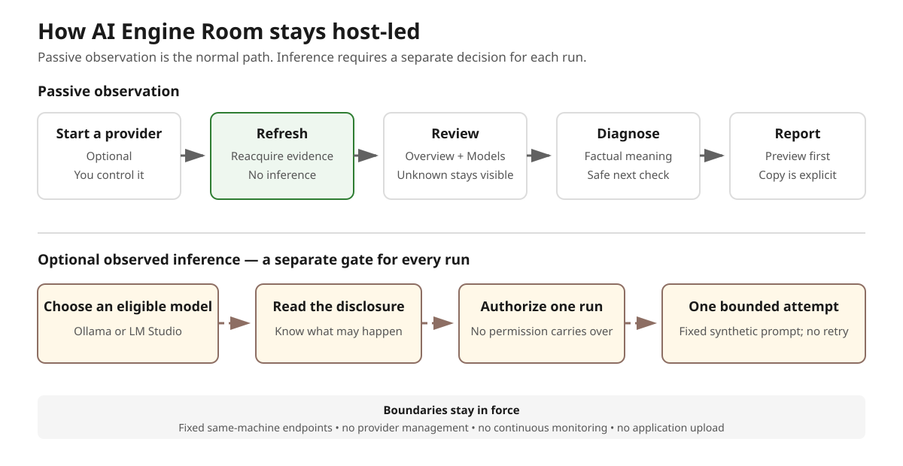

# AI Engine Room

[](https://github.com/gregweir/ai-engine-room/actions/workflows/deterministic.yml)
[](LICENSE)

**AI Engine Room helps everyday users understand what their local AI runtimes
are doing—without managing servers, running inference unless explicitly
authorized, or making decisions on their behalf.**

It is a privacy-conscious, pre-release desktop utility organized around a
simple workflow: **Observe → Explain → Diagnose → Report**. It turns bounded,
explicitly requested observations from supported same-machine runtime APIs and
the operating system into plain-language context while keeping missing or
unverified evidence visibly unknown.

Developed by Greg Weir. Released by Tartanleaf.com Inc.

Version 0.1.0. Copyright © 2026 Tartanleaf.com Inc. Licensed under [Apache-2.0](LICENSE).

## Why it exists

Local AI tools expose useful information in different places and with different
meanings. AI Engine Room brings a deliberately narrow set of observations
together to help answer questions such as:

- Which supported runtime endpoints are responding on this computer?
- Which models do those providers report as available or loaded?
- What system-memory context and provider-qualified model metadata are
  available?
- What factually changed between two explicit observations in this app session?
- What does an observation mean, and what is a safe next check, without turning
  it into a benchmark, root-cause claim, or recommendation?

The application reports what its bounded sources provide. It does not claim to
prove exact CPU/GPU placement, per-model memory use, model fit, or whether an
Ollama request ultimately executes on this machine.

## Safety is a feature

AI Engine Room is intentionally conservative and host-led:

- **Refresh does not run or authorize inference.** It reacquires the supported
  runtime and machine observations only when requested.
- **Observed inference is optional and explicit.** After a per-run disclosure
  and authorization, the app can send one fixed synthetic prompt through
  Ollama or LM Studio with bounded timeout and concurrency and no retry.
  llama.cpp remains passive-only.
- **The app does not manage providers.** It does not call model-management APIs
  or start, stop, unload, or reconfigure a provider. An authorized LM Studio
  observation may still cause LM Studio itself to JIT-load an unloaded model.
- **Collection is not continuous.** There is no polling, background sampling,
  account, telemetry, upload, or application persistence. Bounded recent
  observations live only in the current app session.
- **Provider access stays narrow.** The implemented integrations use fixed
  numeric same-machine loopback endpoints; they do not scan the network or use
  configured LAN, remote, or cloud destinations.
- **Uncertainty stays visible.** The app does not turn missing evidence into
  estimates, confidence scores, causal diagnosis, automated repair, or
  unsupported safety and performance claims.

## Quick start

1. Review the verified platform baselines and limitations below, then use only
   the official
   [`v0.1.0-preview.1` release](https://github.com/gregweir/ai-engine-room/releases/tag/v0.1.0-preview.1).
2. Download the package for your platform and `SHA256SUMS.txt`. Verify the exact
   filename, byte size, and complete SHA-256 before installing. The preview is
   unsigned; a matching checksum verifies bytes but does not authenticate its
   publisher.
3. Install only if those details match and your platform permits normal
   continuation. Do not weaken security controls or bypass organizational
   policy to run the preview.
4. Start a supported local-AI runtime yourself if you want provider
   observations, then open AI Engine Room. The app does not start or manage
   providers.
5. Choose **Refresh** for passive observation. Refresh does not run or authorize
   inference.
6. Explore **Overview**, **Models**, **Diagnose**, and **Report**. Use
   **Observed inference** only after reading its disclosure and explicitly
   authorizing that individual run.

The [full user guide](docs/user-guide.md) provides exact verification,
installation, first-session, and removal instructions. See the
[glossary](docs/glossary.md) for the application's evidence and safety terms.



*Conceptual workflow derived from implemented behavior; this is not a native
application screenshot.*

## Current capabilities

- Manually refresh independent Ollama and LM Studio availability, model catalogues, loaded state, and bounded platform-native machine context: available memory, total memory, and native CPU architecture.
- Inspect LM Studio native REST v1 model metadata and distinct loaded instances; one bounded developer-authorized live integration test has passed on the verified Ubuntu development environment.
- Passively detect a traditional single-model llama-server at the fixed same-machine endpoint `127.0.0.1:8080` and display one validated provider-reported served-model ID. Bounded developer verification passed on the tested Ubuntu 24.04 LTS x86_64 baseline. It does not run llama.cpp inference or manage the server or model.
- Display provider-qualified model-size and configured-context evidence with
  explicit distinctions among system memory, model weights, loaded size, KV
  cache, runtime overhead, VRAM, and compute placement. Missing evidence stays
  unavailable or unknown; no values are combined into unsupported memory or fit
  claims.
- Retain the newest 12 Available-memory startup and explicit **Refresh** observations for the current app session as an ordinal sequence with numeric values and controlled gaps. This is observation history, not continuous monitoring or regularly timed sampling.
- After a per-run disclosure and authorization, run one fixed synthetic prompt with bounded timeout, concurrency, and no retry. Ollama execution location remains undetermined; LM Studio API scope is same-machine loopback while exact compute placement is not independently verified. Results are descriptive observations, not benchmarks.
- Keep recent observations and comparisons in memory for the current session only.
- Use the **Diagnose** workspace to review the newest 12 startup and explicit **Refresh** observation bundles, factual same-source changes, controlled source gaps, and deterministic **Observation → Meaning → Safe next check** findings. Provider-qualified model identities are correlated only within the same provider; Diagnose adds no acquisition, monitoring, persistence, root-cause claim, automated repair, or provider action.
- Preview a human-readable, allow-listed, sanitized plain-text report with friendly and exact byte presentation plus controlled source and qualification text. In the native app, **Copy report** writes exactly that preview to the system clipboard after an explicit action. Other applications may read clipboard contents; AI Engine Room does not read, clear, persist, upload, save, or send the report.

AI Engine Room performs no automatic inference. Use **Refresh** to reacquire status; viewing or refreshing the dashboard does not authorize inference or write the clipboard. Available-memory session history adds no polling, persistence, trend, threshold, pressure, health, model-fit, or headroom judgement.

## Support and requirements

**Verified public-preview and `.deb` packaging baseline: Ubuntu 24.04 LTS x86_64. Developer install, launch, graphical, and removal verification passed for the exact published unsigned preview package.**

**Verified public-preview and Windows packaging baseline: Windows 11 25H2 build 26200.7462 x64. Developer install, native launch, graphical/accessibility, passive-behavior, and removal verification passed for the exact published unsigned NSIS preview package.**

The exact accepted `.deb` and NSIS files are available from the
[`v0.1.0-preview.1` unsigned prerelease](https://github.com/gregweir/ai-engine-room/releases/tag/v0.1.0-preview.1).
They are not signed, stable, production-ready, or broadly compatible. Verify a
download's exact filename, byte size, and SHA-256 against that release page
before installation.

The implemented inference runtime integrations are Ollama and LM Studio. LM Studio 0.4.0 or newer must serve native REST v1 at the fixed same-machine endpoint `127.0.0.1:1234`; authenticated, custom-port, LAN, and remote access are not supported in 1L. One bounded developer-authorized LM Studio live integration test has passed on the verified Ubuntu development environment; broader compatibility is not claimed, and compute placement remains not independently verified.

AI Engine Room can passively detect and display a traditional single-model llama-server on the tested Ubuntu 24.04 LTS x86_64 baseline at the fixed same-machine endpoint `127.0.0.1:8080` when the developer operates the existing server and it reports a safe served-model identity. The tested contract used Snap `llama-cpp` label `b9969`, revision `307`, and server build commit `76f2798`. The integration uses only `GET /health` and `GET /v1/models`, validates `data[].id` as the served-model ID, rejects redirects and unsafe/path-like identity, and treats the result as one served model rather than a catalogue. It does not run llama.cpp inference, manage the server or model, support router mode/authentication/TLS/custom endpoints/LAN/remote access, verify compute placement, or establish compatibility with other llama.cpp builds, configurations, or platforms.

On the tested Windows 11 25H2 build 26200.7462 x64 baseline, AI Engine Room successfully detected and displayed Ollama and LM Studio simultaneously through their existing fixed loopback APIs. Passive catalogue and loaded-state verification, provider coexistence, navigation, and one **Refresh** passed without inference or model/service management. The tested Ollama version was 0.32.15, and LM Studio used native REST v1. This does not establish broader Windows/provider configuration compatibility or Windows inference. Ollama retains its existing execution-location qualification; LM Studio API scope is same-machine loopback while compute location is not independently verified.

AI Engine Room's Windows available-memory observation has passed native compilation, current-source unsigned NSIS packaging, and developer package verification on Windows 11 25H2 build 26200.7462 x64. The value is the operating system's reported available physical memory and is not claimed to be numerically equivalent to Linux `MemAvailable`. This evidence does not establish other Windows versions, builds, architectures, or machines; Windows provider functionality or inference; memory-pressure, model-fit, or headroom recommendations; or verified compute placement. That evidence predates and does not cover the newer total-memory and CPU-architecture fields; the tested artifact is unsigned, and this is not a production-ready, release-candidate, or public-release claim. See the [bounded verification record](docs/release/windows-available-memory-verification.md).

Milestone 1U implements total-memory and native-CPU-architecture context for Ubuntu and Windows. Linux total memory uses `/proc/meminfo` `MemTotal` usable-memory semantics; Windows uses `MEMORYSTATUSEX.ullTotalPhys` physical-memory semantics. CPU architecture is categorical machine metadata rather than a numeric metric. On the tested Windows 11 25H2 x64 environment, bounded native compilation, strict Clippy, exact total-memory value agreement, native-architecture presentation, normal and narrow layouts, keyboard focus, and developer-established 225% Windows Text-size presentation passed. These new fields remain outside Report and make no model-fit, acceleration, performance, or compute-placement claim. This evidence does not establish broad Windows compatibility, packaging or release readiness, or a general Windows support claim.

The Windows evidence is limited to the tested Windows version, build, architecture, machine, and provider configuration—not other Windows environments. Other Linux distributions and architectures and macOS are not currently claimed. Browser/LAN mode is artificial-fixture development presentation only, without native/live feature parity or native Copy.

See [SUPPORT.md](SUPPORT.md) for the precise matrix and limitations.

Source development requires Node.js/npm compatible with the committed lockfile; Rust and Cargo compatible with `rust-version` in `src-tauri/Cargo.toml`; and the Tauri 2 Linux system prerequisites for Ubuntu. Ollama or LM Studio is needed only for optional, explicitly authorized live runtime work. Deterministic tests require neither runtime and perform no inference.

Bounded GitHub Actions run deterministic frontend and Rust checks on Ubuntu and
Windows for pull requests and the main branch. The workflow also builds
ephemeral `.deb` and NSIS packages to verify their licence payloads, but uploads
no artifact and performs no live provider access, inference, signing,
publication, or release. Native UI, accessibility, provider, installation, and
removal evidence remains developer-controlled on the designated physical
machine.

## Build and run from source

```sh
npm ci
npm run check
npm run lint
npm run test:run
npm run tauri dev
```

Use `npm run build` for the frontend and `cargo build --workspace` for the Rust workspace. Historical local unsigned `.deb` verification is documented in [Linux pre-release packaging verification](docs/release/linux-pre-release-verification.md); those evidence artifacts remain distinct from the exact files later accepted and published in the [`v0.1.0-preview.1` unsigned prerelease](https://github.com/gregweir/ai-engine-room/releases/tag/v0.1.0-preview.1). AppImage packaging is deferred after the tested path failed runtime acceptance on the verified baseline.

## Privacy and data boundaries

The application is passive until the user refreshes or explicitly authorizes an Ollama or LM Studio observation. It has no accounts, telemetry, or application persistence. The bounded Available-memory and diagnostic observation histories exist only in frontend memory for the current app session and reset at restart. Diagnostic model identities remain provider-qualified, are bounded before retention, are never correlated across providers, and do not enter Report. Runtime and resource data stay in the current app process, except for bounded requests to the fixed same-machine provider APIs and text the user explicitly copies to the operating-system clipboard. llama.cpp acquisition is GET-only and accepts no path-like identity. An LM Studio observation is stateless (`store:false`) but may JIT-load an unloaded model and LM Studio may later auto-unload it according to its configuration. AI Engine Room does not call model-management APIs. A loopback endpoint does not independently prove exact compute placement, so execution location is not asserted.

The browser/LAN preview uses artificial fixtures and must not be treated as live native telemetry. Do not use generated output or observations as benchmark results.

## Project documents

- [User guide](docs/user-guide.md)
- [Glossary](docs/glossary.md)
- [Roadmap](docs/roadmap.md)
- [Contributing](CONTRIBUTING.md)
- [Support](SUPPORT.md)
- [Security](SECURITY.md)
- [Code of Conduct](CODE_OF_CONDUCT.md)
- [Changelog](CHANGELOG.md)
- [Licence](LICENSE)

This project is pre-release and incomplete. It is not production-ready, a release candidate, privacy- or security-certified, or a guarantee of local inference.
