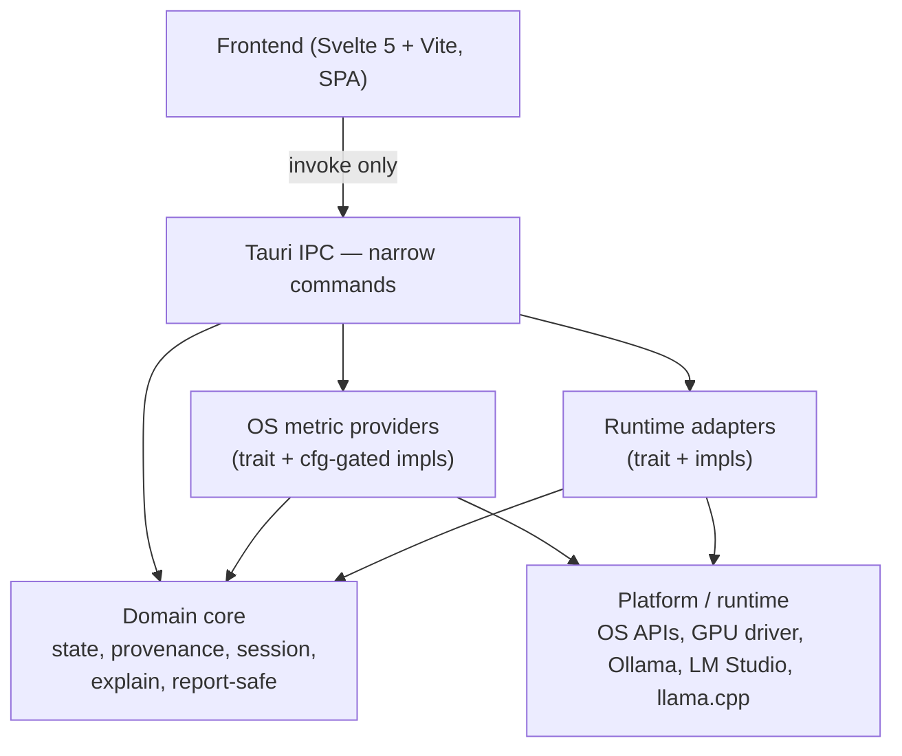
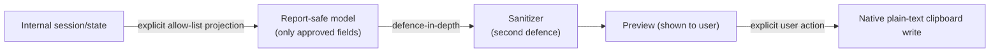

# AI Engine Room — Architecture and Design

Status: Draft
Scope: Current pre-release product (Observe → Explain → Diagnose → Report).

This document is the primary design reference for AI Engine Room. It defines
the product boundary, the architectural layers and trust boundaries, the core
domain/state model, and the acceptance criteria for the first two milestones.
It is intentionally not an exhaustive enterprise specification.

Rust type sketches below are **illustrative**. They communicate contracts and
semantics, not final names. Implementers may choose cleaner names provided the
semantic distinctions in this document are preserved.

## 1. Product purpose and boundaries

AI Engine Room is a cross-platform desktop application that helps a
non-specialist understand what local AI is doing on their computer. It is not a
benchmark tool or an expert hardware monitor. The goal is not to maximize the
number of metrics displayed, but to help a user observe local AI resource use,
understand what it means, and make a sensible decision.

The product sequence for the initial release is:

**Observe → Explain → Diagnose → Report**

In scope:

- detecting whether a supported local-AI runtime is present;
- observing resource use and runtime/model state;
- explaining metrics in plain language while retaining technical terms;
- producing privacy-conscious local session reports;
- comparing explicit session observations and offering deterministic, non-causal
  next checks;
- accessible, calm, low-density presentation.

Out of scope for the initial release:

- benchmarking, performance scoring, or hardware-fit rankings;
- automatic tuning, model management, or model downloading;
- cloud services, accounts, or telemetry by default;
- an embedded language model for explanation;
- automated diagnosis, root-cause claims, repair, or provider/model mutation.

The application must operate sensibly when no supported runtime is present, and
must distinguish unavailable functionality from actual errors.

## 2. Architecture overview

Stack (architectural commitments):

- Tauri 2 as the desktop application framework;
- Rust for the native/backend layer;
- Svelte 5 + Vite for the frontend, as a single-page application;
- no SvelteKit, no server-side rendering.

The system is layered so that a cross-platform domain core is insulated from
platform and runtime specifics. Platform code and runtime code depend on the
core; the core depends on neither.



Arrows mean "depends on / uses." The core has no incoming dependency from
platform or runtime code. Linux and Windows specifics live behind traits. Ollama, LM
Studio, and passive llama.cpp provider state live in provider-specific
application runtime modules without changing the dependency-neutral core.

Initial development target: Linux (Ubuntu), with Ollama and LM Studio runtime
adapters added after the architectural skeleton. LM Studio uses native REST v1
only at fixed numeric loopback and coexists with Ollama. The passive llama.cpp
adapter observes one developer-operated traditional single-model server at fixed
numeric loopback and requires a validated provider-reported served-model ID;
it has no inference or management surface. Linux and Windows implement the
platform-native available-memory observation as `os.ram.available` and bounded
total-memory (`os.ram.total`) and
native-CPU-architecture context; the latter is categorical application metadata
rather than a numeric metric and neither new field enters Report. Linux
`MemTotal` retains usable-memory semantics and Windows `ullTotalPhys` retains
physical-memory semantics. Current-source native compilation and package
verification passed for Windows available memory on the tested Windows 11 25H2
build 26200.7462 x64 baseline. Separate bounded evidence on that tested Windows
environment established native compilation, strict Clippy, exact total-memory agreement,
controlled native-architecture presentation, normal and narrow layouts,
keyboard focus, Report exclusion, and developer-established 225% Windows Text-size
presentation for the new fields. It does not establish broad Windows
compatibility, packaging or release readiness, WCAG conformance, or a general
Windows support claim. Broader Windows OS telemetry remains deferred.

## 3. Trust and data boundaries

- **Privileged access stays in Rust.** Operating-system metrics, GPU access,
  and local-AI runtime communication happen only in the Rust backend. The
  frontend never calls the OS, a GPU driver, or a runtime API directly.
- **Tauri IPC is narrow.** Commands expose only the data and actions the UI
  needs. There is no generic command-execution, filesystem-access, or
  unrestricted system-information command.
- **Report privacy is allow-list first.** Reports are built by projecting only
  deliberately approved fields into a report-safe model. A sanitizer acts as a
  second defence, not the primary boundary. See §8.
- **LAN preview is UI-only.** Browser preview over the LAN serves frontend
  assets and mock fixtures only — never real telemetry, runtime control, or
  Tauri commands. See §10.
- **No telemetry by default.** No account, no network reporting. Local reports
  are an explicit, user-approved action.

## 4. Core domain and state model

The core defines the value model, provenance, and the separate concepts that
govern whether a value exists: support, source availability, metric
availability, and acquisition outcome. These are distinct and must not be
conflated.

### 4.1 Value and provenance

Provenance describes **how a value that exists was obtained**. It applies only
when there is a value. Provenance is not a confidence ranking.

```rust
// Illustrative
enum Provenance {
    OperatingSystemReported,            // read from the OS (e.g. /proc, sysfs)
    DriverReported,                     // from a hardware driver API (e.g. GPU)
    RuntimeReported,                    // from the AI runtime's own API
    ApplicationMeasured,                // Engine Room measured it (e.g. elapsed time)
    Calculated { inputs: Vec<MetricRef>, formula: Formula },
    Estimated  { inputs: Vec<MetricRef>, assumptions: Model, limitations: Vec<Limitation> },
}
```

- `Calculated` is deterministic arithmetic over identified inputs. It must
  preserve the inputs and their provenance, and the calculation/formula.
- `Estimated` involves assumptions, modelling, or approximation rather than
  pure arithmetic. It must remain distinct from `Calculated` and preserve
  relevant inputs, the assumptions/model, and important limitations.
- `ApplicationMeasured` means Engine Room itself performed the measurement (for
  example, an elapsed duration measured with a local clock), as opposed to
  reading a value someone else reported.

`MetricSample` carries only what is required to represent the observation and
its provenance (value, unit, provenance, timestamp, known limitations). It does
not carry validation or test-evidence fields. Validation evidence is a separate
concern that lives in tests, in provider implementation documentation, and
optionally in a future metric-definition/catalogue model (a stable identifier,
display name, unit, source class, acquisition method, applicable
platform/runtime, known limitations, and a documentation/verification
reference). That catalogue is not implemented now; this design only preserves
the separation between a runtime observation and its verification evidence.

### 4.2 Support (capability)

Whether Engine Room knows how to acquire the metric or interact with the
provider/runtime on this platform and in this implementation.

```rust
enum Support {
    Supported,
    Unsupported { limitation: Limitation },   // controlled reason, not an error
}
```

`Unsupported` is a stable capability statement (for example, "GPU metrics are
not implemented in this build"). It is not a runtime failure.

### 4.3 Availability

Availability is two distinct concepts, not one shared enum: **source
availability** and **metric availability**.

**Source availability** describes whether the external source required to
acquire information is currently usable.

```rust
enum SourceAvailability {
    Ready,        // source present, reachable, responding
    NotDetected,  // source not found at all
    NotRunning,   // detected but not responding (installed, stopped)
    Unreachable,  // detected as a target but cannot be reached
}
```

**Metric availability** describes whether a particular metric is currently
obtainable once its source context is considered.

```rust
enum MetricAvailability {
    Available,              // source ready and the metric is exposed
    NotExposed,             // source ready but does not expose this metric
    TransientlyUnavailable, // source ready but cleanly indicates "not now"
    NotApplicable,          // support is Unsupported, so the metric is moot
}
```

Metric availability is not forced to pretend it has been evaluated when the
source itself is unavailable. When the source is not `Ready`, metric availability
is left unevaluated (for example `Option::None`) rather than guessed.
`NotApplicable` is used when `Support` is `Unsupported`. The model does not use
an ambiguous textual `N/A` to mean several different things; unsupported,
unavailable, unknown, and not-applicable are not collapsed into one value.

### 4.4 Acquisition outcome

The result of an acquisition attempt.

```rust
enum Outcome {
    Ok(MetricSample),       // a value exists; carries Provenance
    NoValue,                // no value; explained by support/availability (normal)
    Failed(AcquisitionError),
}

enum AcquisitionError {
    Connection { .. },
    Timeout { .. },
    Parsing { .. },
    Measurement { .. },
    Permission { .. },
    Other { .. },
}
```

A missing runtime or unavailable metric is a **normal** state (`NoValue`),
explained by `Support` and source/metric availability. An actual connection,
timeout, parsing, measurement, or permission failure is `Failed` and remains
distinguishable from absence or lack of support. Arbitrary raw system/provider
errors are not exposed directly as user-facing messages; they are mapped to
controlled categories and report-safe messages.

### 4.5 Composition

A metric result combines support, source availability, metric availability,
and the acquisition outcome:

```rust
struct MetricResult {
    support: Support,
    source_availability: SourceAvailability,
    metric_availability: Option<MetricAvailability>, // None when source not Ready / unevaluated
    outcome: Outcome,
}
```

| Support       | Source availability | Metric availability | Outcome       | Meaning                                             |
| ------------- | ------------------- | ------------------- | ------------- | --------------------------------------------------- |
| `Unsupported` | (not evaluated)     | `NotApplicable`     | `NoValue`     | Not implemented here; show limitation, not an error |
| `Supported`   | not `Ready`         | `None`              | `NoValue`     | Normal: source state explains why there is no value |
| `Supported`   | `Ready`             | not `Available`     | `NoValue`     | Normal: metric state explains why there is no value |
| `Supported`   | `Ready`             | `Available`         | `Ok(sample)`  | A value was acquired; sample carries provenance     |
| `Supported`   | `Ready`             | `Available`         | `Failed(err)` | An actual acquisition attempt failed                |

**Provenance attaches only to `Ok`.** When there is no value, there is no
provenance — only support and availability (and possibly a `Failed` error).

### 4.6 Timeout rule

- A source that cleanly reports "not available now" → metric availability
  `TransientlyUnavailable` with `NoValue` (normal state).
- An acquisition operation against a source expected to respond that exceeds
  its defined timeout → `Failed(Timeout)` (an acquisition failure).

The user-facing presentation may treat retryable failures calmly and
proportionately; a timeout is still classified as a failure, not as normal
unavailability.

### 4.7 Core independence

The core depends only on its own types and the standard library. It must not
depend on `sysinfo`, an NVML wrapper, a specific HTTP client, or any
platform/runtime crate. Platform and runtime types do not appear in core
interfaces.

## 5. Provider and runtime interfaces

Two trait families sit behind the core. Traits live in the core; implementations
live in platform/runtime modules and depend on the core.

```rust
// Illustrative
trait OsMetricsProvider {
    fn source_availability(&self) -> SourceAvailability;
    fn acquire(&self, metric: MetricId) -> MetricResult;
    fn list_metrics(&self) -> Vec<MetricDescriptor>;
}

trait AiRuntimeAdapter {
    fn detect(&self) -> SourceAvailability;
    fn list_models(&self) -> MetricResult;        // runtime-reported catalogue
    fn loaded_models(&self) -> MetricResult;      // currently resident
    fn runtime_metrics(&self, metric: MetricId) -> MetricResult;
}
```

- `OsMetricsProvider` implementations are gated by `cfg(target_os)`: the Linux
  provider reads `/proc/meminfo` `MemAvailable`, while the Windows provider
  reads only `MEMORYSTATUSEX.ullAvailPhys`. Only the relevant real platform
  acquisition is compiled for a target; unsupported production targets retain
  an empty OS snapshot.
- `AiRuntimeAdapter` remains the minimal dependency-neutral interface. Rich
  Ollama and LM Studio inventory/inference DTOs and the passive llama.cpp
  snapshot use small provider-specific application-layer adapters. A missing
  provider is a normal independent state and does not suppress another
  available provider.
- No Ollama, LM Studio, or llama.cpp types appear in the trait or the core. An
  adapter may use an HTTP client internally, but the trait surface is
  pure-domain.
- Implementation libraries (for example `sysinfo`, a particular HTTP client, an
  NVML wrapper) are **likely implementation options chosen at the relevant
  milestone**, not architectural commitments. See §14.

## 6. Explanation architecture

Explanation logic lives in the deterministic Rust/domain side — not in the
frontend and not in an embedded language model. Explanations are derived from
known state and evidence.

```rust
// Illustrative
struct Explanation {
    interpretation: ControlledMessage,
    why_it_matters: ControlledMessage,
    deeper: Option<ControlledMessage>,
}
```

The user-facing pattern for an important metric is:

- metric name;
- value/status;
- interpretation;
- why it matters;
- optional deeper explanation.

Rules:

- Explanations must not invent certainty beyond the underlying value and its
  provenance.
- Normal high utilization is not classified as dangerous merely because a
  number exceeds a threshold, unless product evidence supports that
  interpretation.
- Threshold and rule design is replaceable and unit-testable. Rules are data
  plus pure functions over `MetricSample` and state, registered by metric.

## 7. Session architecture

A minimal in-memory model sufficient for observation and report generation.

```rust
// Illustrative
struct Session { started: Timestamp, snapshots: Vec<Snapshot>, events: Vec<Event> }
struct Snapshot { at: Timestamp, samples: Vec<MetricResult>, explanations: Vec<Explanation> }
enum Event { /* notable state changes: model load/unload, support/availability transition, ... */ }
```

- Snapshots are timestamped collections of metric results with associated
  explanations.
- Events mark notable runtime/model state changes (added later as runtimes are
  integrated).
- State is in-memory by default. There is no database, no cloud synchronization,
  and no historical analytics platform in this design. Local persistence is
  added only if an approved feature requires it, and only for sanitized,
  user-approved data.
- The frontend separately retains the newest 12 Available-memory acquisition
  events for the current app session. Startup and each completed explicit
  Refresh snapshot attempt add one oldest-to-newest event; duplicates and
  successful zero remain numeric, while unavailable, failed, missing, rejected,
  unsupported, or unsafe values remain controlled nonnumeric gaps. This type is
  deliberately separate from authorized inference history.
- The Available-memory sequence resets at app restart/remount. It has no timer,
  polling, persistence, save, or clear path, and navigation, Report viewing,
  Copy, and inference do not append events.
- A separate frontend diagnostic history retains the newest 12 bounded
  observation bundles, oldest to newest, with monotonically increasing session
  IDs. Startup adds observation 1 and each completed explicit Refresh attempt
  adds exactly one later bundle. Each bundle is assembled after the independent
  calls started by that acquisition invocation settle; it is not presented as
  an atomic machine snapshot.
- Diagnostic bundles retain only controlled source state, Available-memory
  value/gap category, bounded exact provider-qualified model identities needed
  for same-provider set correlation, and LM Studio loaded-instance membership.
  Invalid, path-like, unbounded, or rejected source data fails closed to a gap.
  Gaps remain unknown and cannot be interpreted as empty sets or numeric zero.
- The pure factual delta layer states only whitelisted differences between two
  adjacent explicit observations. The provider-aware Rust diagnosis command
  consumes a bounded projection of already-acquired views and returns fixed
  **Observation → Meaning → Safe next check** findings. It performs no I/O,
  acquisition, inference, persistence, or mutation. Cross-provider identity
  equivalence is never inferred.

## 8. Report privacy architecture

Reports use explicit data minimization. The report-safe model is **not** a
serialization of the full internal `Session`.



Flow: internal session/state → **explicit allow-listed report-safe model** →
**defence-in-depth sanitizer** → **preview** → **explicit native clipboard
copy**.

Rules:

- Only deliberately approved fields cross into the report-safe model.
- Excluded by default: usernames, absolute paths, hostnames, network addresses,
  serial numbers, machine identifiers, arbitrary provider diagnostics, raw
  error messages, environment variables, model prompts, and generated content.
- The report-safe model uses structured limitation/status codes and controlled
  human-readable messages rather than arbitrary internal or provider strings.
  Free-form diagnostics remain inside unless deliberately transformed into
  public-safe content.
- The sanitizer is a second line of defence against unexpected identifying
  content (for example, an identifier that appears inside a value). It is not
  relied upon as the primary boundary.
- Milestone 1J can copy exactly the existing human-readable preview to the
  system clipboard in the native app. It grants only plain-text clipboard write
  authority and warns that other applications may read clipboard contents. It
  does not read the clipboard, save files, or send/upload the report. Save and
  external Share remain deferred; no additional export format (Markdown, HTML,
  JSON, or other) is committed.
- The server-authored plain-text renderer presents byte values in decimal SI
  units alongside exact comma-grouped bytes when the report-safe numeric value
  is exactly representable. Values outside that presentation range are marked
  approximate and are never printed as exact. The renderer may show only the
  already-projected payload-free provenance and controlled limitation messages;
  it does not render `ReportSnapshot.at` or expand `REPORT_ALLOWED_METRICS`.

## 9. Frontend and native boundary

The frontend is Svelte 5 + Vite, built as a single-page application with no
server-side rendering. It reaches the backend only through Tauri `invoke`
commands. It renders metric cards, explanations, session state, and the report
preview; it does not reason about metrics and does not call OS or runtime
facilities.

Accessibility and presentation are first-class from the start, not deferred:

- semantic HTML;
- full keyboard operation and visible focus;
- support for enlarged text and responsive layouts;
- non-colour status communication (text/shape, not colour alone);
- reduced-motion support;
- a readable metric/explanation hierarchy.

The Available-memory session view uses unconnected ordinal markers: spacing is
observation sequence, not elapsed time. Nonnumeric events occupy a separate
hollow-marker lane and never become zero. The inline SVG is supplementary to a
visible textual summary and ordered observation list. There is no line,
smoothing, interpolation, threshold, trend, pressure, health, fit, or headroom
interpretation. Resource Context remains non-graphical and does not put OS
Available memory and provider-reported model memory on a common scale.

Milestone 1V adds a controlled, nonnumeric resource-evidence distinction list
to that existing Resource Context. It separately identifies system memory,
model weights, provider-reported loaded size, configured context, KV cache,
runtime overhead, VRAM, and compute placement. The provider surfaces retain the
individual Ollama and LM Studio values and show explicit not-reported states.
Catalogue size is not treated as loaded memory; configured context is not
converted to bytes; and KV-cache bytes, runtime-overhead bytes, physical VRAM
capacity, and compute placement remain unavailable or unknown. The composition
uses only the views already acquired by manual Refresh, adds no provider or OS
call, and does not enter Diagnose or Report.

Small text-first evidence labels distinguish OS observations,
provider-reported state, directly observed inference, and qualifications.
Existing controlled unavailable states and the artificial browser-fixture
banner remain explicit, and colour is never the only distinction.

The intended visual character is calm, editorial, approachable, and technically
credible. The interface is not a dense system-monitor dashboard merely because
it displays system metrics. Detailed final visual design is out of scope for
this specification.

The fifth **Diagnose** workspace is a text-first session surface for source
coverage, factual changes since the preceding explicit observation, controlled
findings, and a complete ordinal history equivalent. It has no score, time
axis, monitoring graph, action button, or automatic repair path. Diagnose
state does not enter the report-safe projection: `REPORT_ALLOWED_METRICS`, the
Report DTOs, renderer, acquisition, visible preview, and explicit Copy payload
remain unchanged.

## 10. LAN preview model

Two development modes:

- **Local-only (default):** the frontend development server binds to loopback.
- **Explicit LAN development mode:** the developer deliberately binds the
  frontend development server to a private LAN interface for visual inspection
  from another trusted device on the same LAN.

LAN preview serves **frontend assets and development-only mock/fixture data
only**. Mock data is clearly identifiable as mock/preview data and is excluded
from production behaviour by build-time mode guards.

LAN preview must **not** receive:

- real privileged system telemetry;
- Ollama or runtime control;
- native filesystem access;
- arbitrary environment information;
- any Tauri privileged command.

This design does not implement a live-metrics LAN bridge. A future live
development bridge would require its own separate design and security review.

Operational rules:

- the bind address is supplied via command-line or environment configuration at
  run time; no machine-specific network details (subnet, IP, hostname) are
  hard-coded in source or committed configuration;
- LAN exposure is an explicit developer choice, never the default;
- no router, firewall, or Internet-facing changes are implied;
- browser preview validates presentation, responsive layout, and accessibility
  only. It does not prove that the native desktop application behaves correctly;
  native behaviour is tested in a real graphical desktop session.

## 11. Testing strategy

This section is forward-looking; it states what will be tested, not what has
been tested.

Rust unit tests:

- provenance semantics (each category, `Calculated` input/formula preservation,
  `Estimated` assumptions/limitations);
- support / source availability / metric availability / outcome composition
  rules, including that `NoValue` is normal and `Failed` is distinguishable, and
  that metric availability is unevaluated when the source is not `Ready`;
- the timeout rule (clean "not now" vs exceeded timeout);
- deterministic explanation rules, including that no threshold asserts danger
  without evidence;
- the report allow-list projection (assert that disallowed fields do not cross
  the boundary) and the sanitizer (second-defence behaviour);
- session/snapshot bookkeeping.
- bounded diagnostic input validation and every deterministic provider-aware
  diagnosis rule, including insufficient-evidence non-triggers, ordering, and
  cross-provider non-equivalence.

Frontend tests:

- rendering of representative mock states: every provenance category, every
  source and metric availability state, and `Ok` / `NoValue` / `Failed`
  outcomes;
- accessibility: keyboard operation, visible focus, ARIA live regions for
  updating values, non-colour status communication;
- responsive layout and enlarged-text behaviour.
- diagnostic history lifecycle/bounds, source-gap containment, factual deltas,
  fifth-tab keyboard semantics, complete text presentation, and Report
  non-interference.

Mock/null providers instantiate every state so the frontend can be tested
without a real backend. Native desktop integration (window behaviour,
permissions, packaging, real OS/runtime behaviour) is tested later in a real
graphical session, not in Milestone 1A.

## 12. Milestone 1A — architectural skeleton

Objective: prove boundaries and state semantics before any real runtime or real
OS provider shapes the interfaces.

Included:

- Tauri 2 + Svelte/Vite scaffold;
- cross-platform domain/state model: metrics, provenance, support, availability,
  acquisition outcome/error;
- `OsMetricsProvider` and `AiRuntimeAdapter` interfaces;
- session/event boundary;
- explanation boundary (rules and tests over mock data);
- report-safe model boundary, allow-list projection, and sanitizer;
- thin Tauri IPC exposing mock data only;
- mock/null provider and runtime implementations that instantiate every state;
- frontend rendering of representative mock states, accessibly;
- loopback frontend development mode;
- explicit LAN mock-preview mode (mock fixtures only, clearly labelled);
- unit tests for the significant domain semantics.

Excluded:

- Ollama integration;
- LM Studio;
- GPU metrics;
- Windows implementation;
- a real OS metric provider implementation;
- actual report export;
- model downloading;
- automatic tuning;
- benchmark ranking;
- telemetry, accounts, cloud services;
- embedded LLM features;
- final visual polish.

Acceptance criteria:

- every boundary exists as a trait or typed model with unit tests;
- no platform-specific or runtime-specific type leaks into the core;
- mock providers can produce every provenance category, every source and
  metric availability state, and every outcome, and the frontend renders them
  accessibly;
- loopback is the default and LAN mock-preview is an explicit, mock-only mode;
- the report path is allow-list first, sanitizer second, with a preview and no
  export format commitment.

## 13. Milestone 1B — first real vertical slice

Objective: prove the interfaces work with real evidence using one narrow metric,
without broadening scope.

One real Linux system metric — RAM information — moves end to end:

OS provider → provenance/domain model → deterministic explanation → thin Tauri
IPC → frontend → explicit report-safe projection → human-readable report
preview.

Included:

- successful path (a real RAM value with full provenance and explanation);
- unavailable path (`NoValue` explained by availability, for example a metric
  not exposed or a source not running);
- failure path (`Failed`, for example an acquisition error), presented calmly
  and distinguishable from unavailability;
- the report-safe projection and one human-readable preview for this metric.

The Linux RAM acquisition library is selected **during 1B**, not fixed in this
specification; the provider interface remains library-agnostic.

Excluded (no scope creep):

- GPU metrics;
- Ollama or any runtime adapter;
- Windows;
- any metric beyond the one chosen;
- export formats beyond the single human-readable preview.

Acceptance criteria:

- one real metric flows through the complete path with full provenance and a
  deterministic explanation;
- unavailable and failure paths are demonstrated with real evidence and remain
  distinguishable from each other and from success;
- the report-safe projection contains only approved fields, with a preview
  shown before any save.

## 14. Deliberately deferred decisions and features

Architectural commitments (decided): Tauri 2, Rust backend, Svelte 5 + Vite
SPA with npm as the package manager, no SvelteKit, no SSR.

Likely implementation options (to be chosen at the relevant milestone, not
fixed now): the OS metric library (for example `sysinfo` or direct filesystem
reads), the HTTP client for runtime adapters, and any GPU/driver library.

Deferred decisions/features:

- licence selection (developer decision);
- report export formats (Markdown/HTML/JSON) — later, based on user need;
- GPU metrics and any driver/NVML integration — beyond 1A/1B;
- broader Windows OS metrics beyond available physical memory — deferred;
- session persistence — only if an approved feature requires it;
- a live-metrics LAN development bridge — separate security review;
- broader diagnosis rules, richer lifecycle presentation, and persisted change
  history — later and subject to separate approval;
- broader visual redesign beyond the restrained observation presentation — later;
- macOS support — future;
- CI, releases, and packaging formats — later.

## 15. Assumptions and unresolved items

Assumptions (to be confirmed at the relevant milestone, not assumed proven):

- the Ollama local HTTP API exposes the runtime metrics needed for Observe
  (to be confirmed by inspection only, not by benchmarking, when the adapter is
  implemented);
- LM Studio native REST v1 supplies downloaded models, distinct loaded
  instances, stateless chat and provider-reported statistics without leaking
  provider JSON types into core. The fixed `127.0.0.1:1234` endpoint follows no
  redirects; authentication tokens, custom ports, LAN and model-management
  actions are outside 1L. Inference may cause disclosed JIT residency changes.
  Observation history retains provider identity and blocks direct
  cross-provider comparison because reporting semantics differ;
- passive llama.cpp support uses only `GET /health` and `GET /v1/models` at
  fixed `127.0.0.1:8080`, follows no redirects, represents one served model
  rather than a catalogue, and accepts only a validated `data[].id`
  served-model identity with the required provider marker.
  It exposes no inference, router, authentication, TLS, custom-endpoint,
  service-control, or model-management surface. API scope is same-machine
  loopback; compute location is not independently verified;
- the system's integrated graphics/NPU, if present, is out of scope for initial
  metrics; GPU metrics target a discrete GPU when GPU work begins.

Unresolved items requiring developer decisions:

- licence selection;
- authorization to scaffold Milestone 1A.

Decided since the draft: the package manager is npm; source availability and
metric availability are separate concepts; `MetricSample` carries no runtime
validation/evidence field.

To verify during implementation:

- runtime behaviour of the selected toolchain on the current Node.js release
  line (declared engine constraints are satisfied; a representative build of
  the selected frontend stack has been observed to succeed; runtime edge cases
  are confirmed as work proceeds);
- GPU/driver library compatibility when GPU metrics are implemented.

Final Rust type names are not fixed by this document; the semantic distinctions
(provenance categories; support vs source availability vs metric availability vs
outcome; allow-list-first reporting) are fixed and must be preserved.
